# 15 Vanilla JavaScript Projects

This repository contains 15 projects built with vanilla JavaScript, inspired by the _FreeCodeCamp_ YouTube video tutorial. These projects are designed to sharpen **_JavaScript_** skills without relying on any frameworks.

## Project Overview

These projects range from simple functions to more complex applications, all implemented using pure JavaScript. They demonstrate various aspects of _JavaScript_ and _DOM_ _manipulation_.

## Goals of this project

1. Improve core JavaScript skills without relying on frameworks or libraries
2. Gain practical experience with DOM manipulation techniques
3. Implement various programming logic and algorithms in real-world scenarios
4. Develop proficiency in creating responsive designs using HTML5 and CSS3
5. Enhance problem-solving skills through diverse coding challenges
6. Practice efficient code organization in vanilla JavaScript applications
7. Utilize GitHub for version control and project management
8. Learn to break down complex problems into manageable components
9. Explore different aspects of JavaScript, from basic concepts to advanced techniques
10. Build a portfolio of projects demonstrating JavaScript proficiency
11. Improve debugging skills in pure JavaScript environments
12. Develop skills in creating interactive user interfaces without UI libraries
13. Gain confidence in building complete web applications from the ground up

## Projects List

1. Color Flipper
2. Counter
3. Reviews
4. Navbar
5. Sidebar
6. Modal
7. Questions
8. Menu `*`
9. Video
10. Scroll
11. Tabs
12. Countdown `*`
13. Paragraph Generator
14. Grocery `*`
15. Slider

`*` larger project

## Project Previews

|                Project 1                 |              Project 2              |              Project 3              |
| :--------------------------------------: | :---------------------------------: | :---------------------------------: |
| 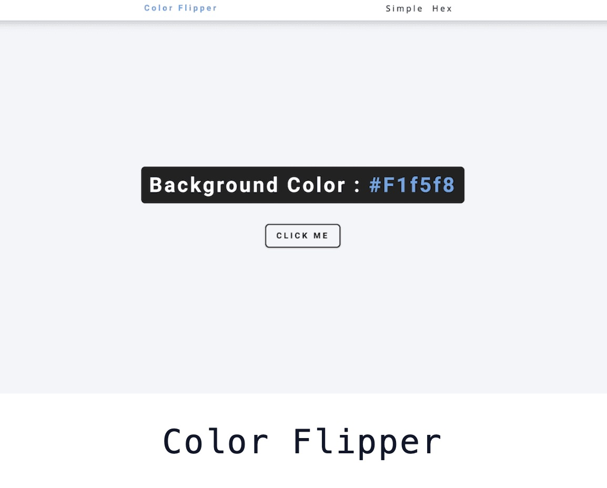 | 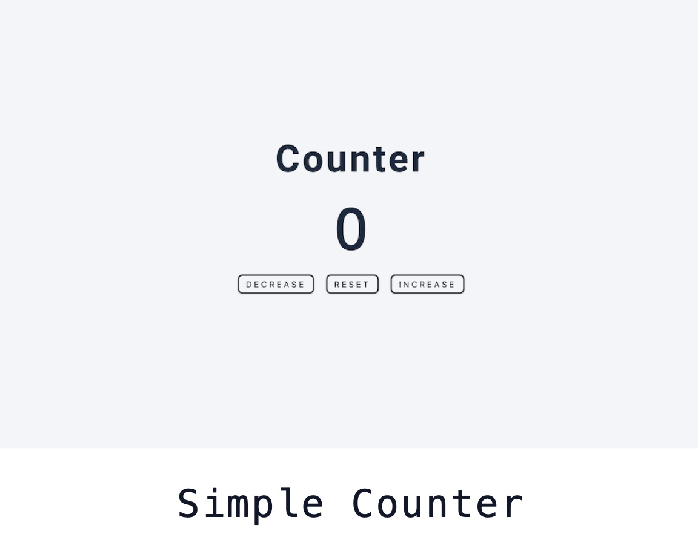 |  |

|             Project 4              |              Project 5              |             Project 6             |
| :--------------------------------: | :---------------------------------: | :-------------------------------: |
| 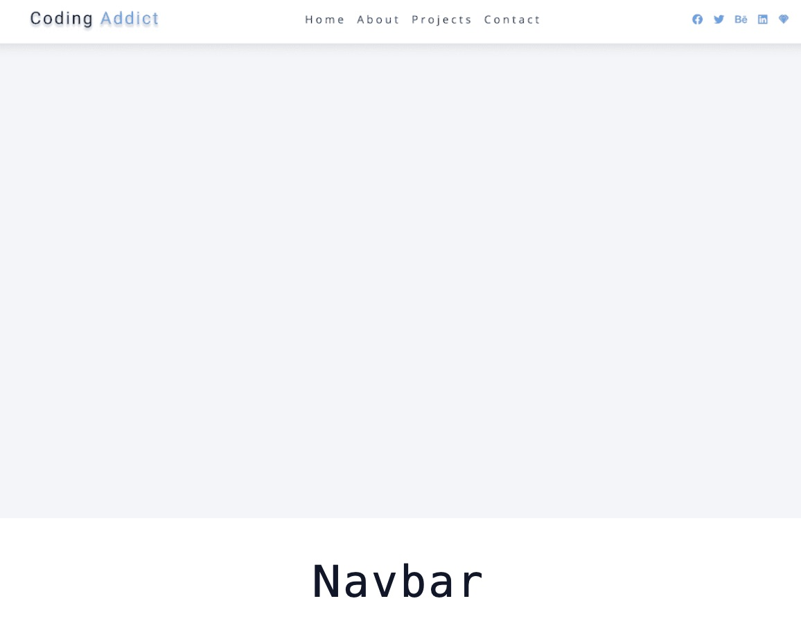 | 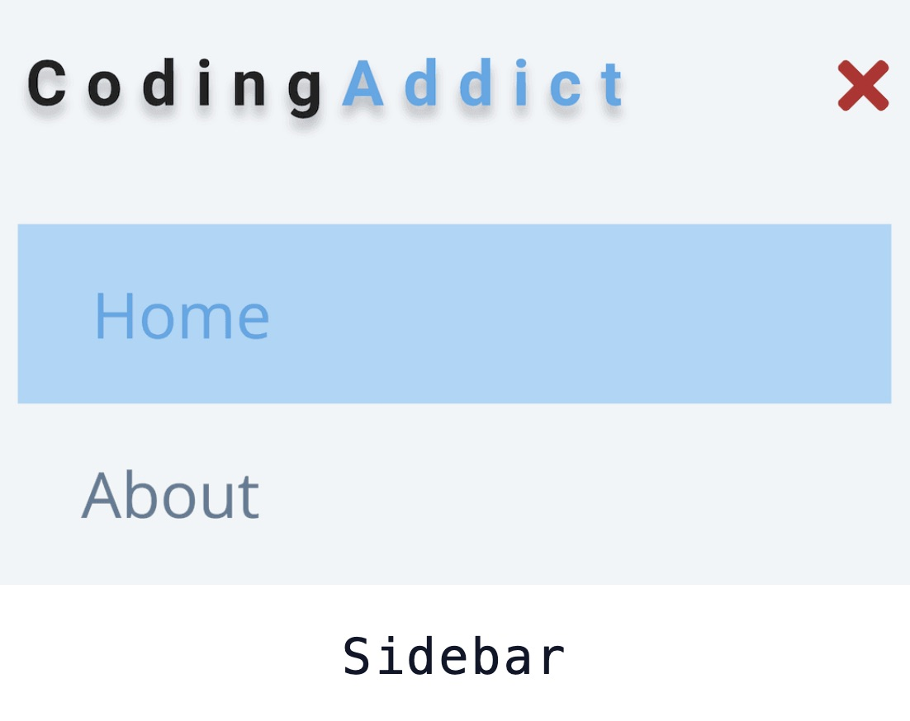 | 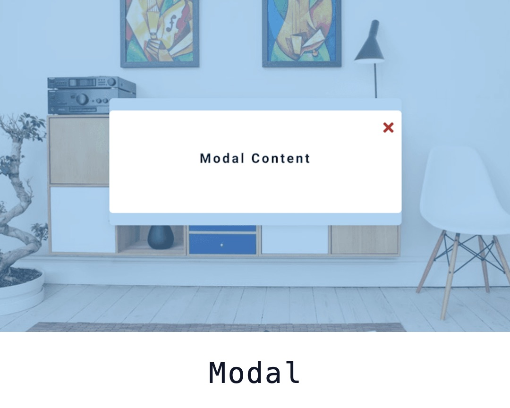 |

|                  Project 7                   |            Project 8             |             Project 9             |
| :------------------------------------------: | :------------------------------: | :-------------------------------: |
|  |  | 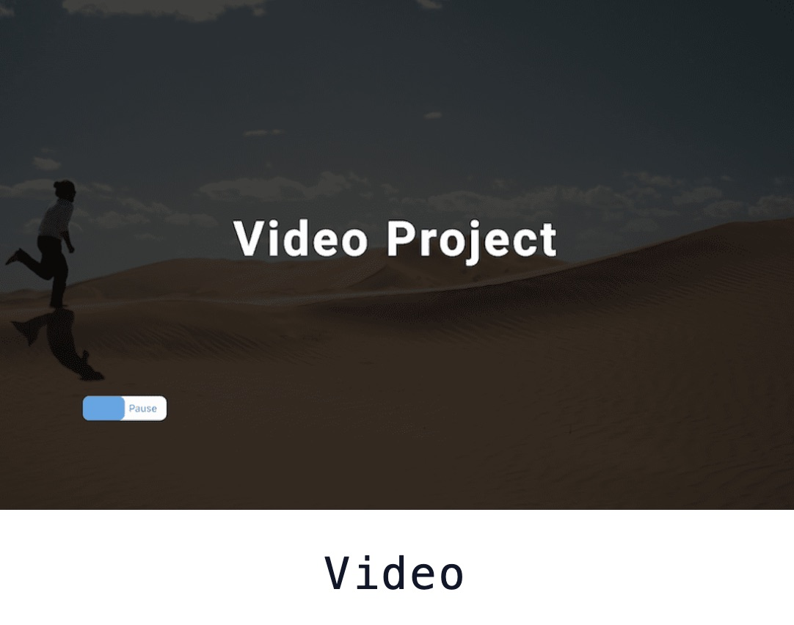 |

|             Project 10              |            Project 11             |                 Project 12                  |
| :---------------------------------: | :-------------------------------: | :-----------------------------------------: |
| 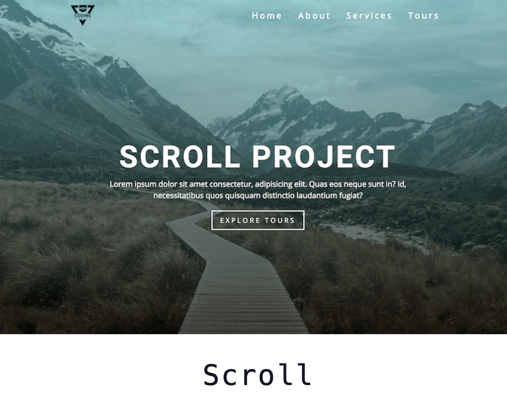 | 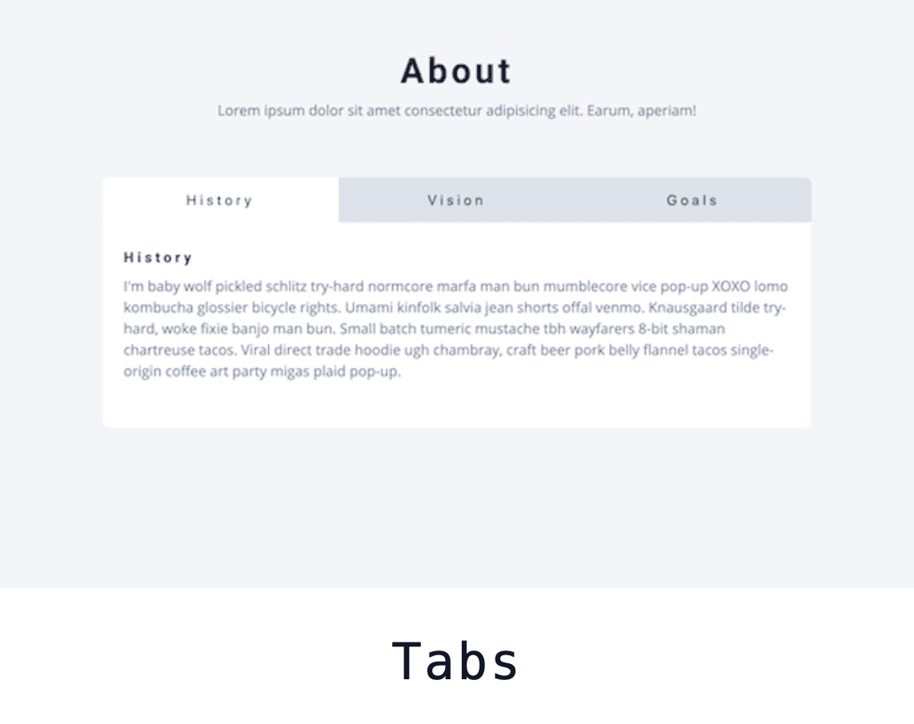 | 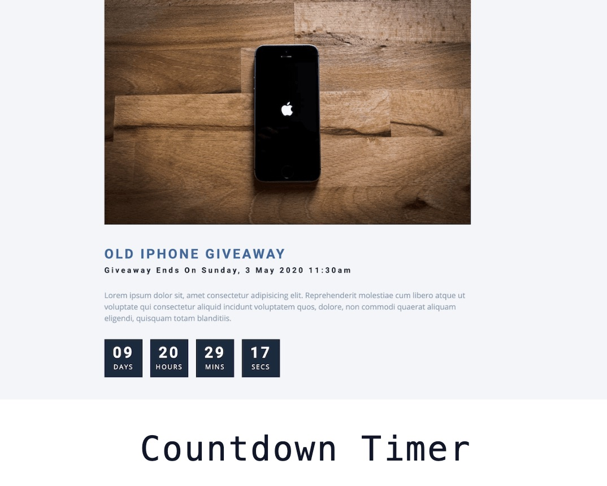 |

|                   Project 13                    |              Project 14              |             Project 15              |
| :---------------------------------------------: | :----------------------------------: | :---------------------------------: |
| 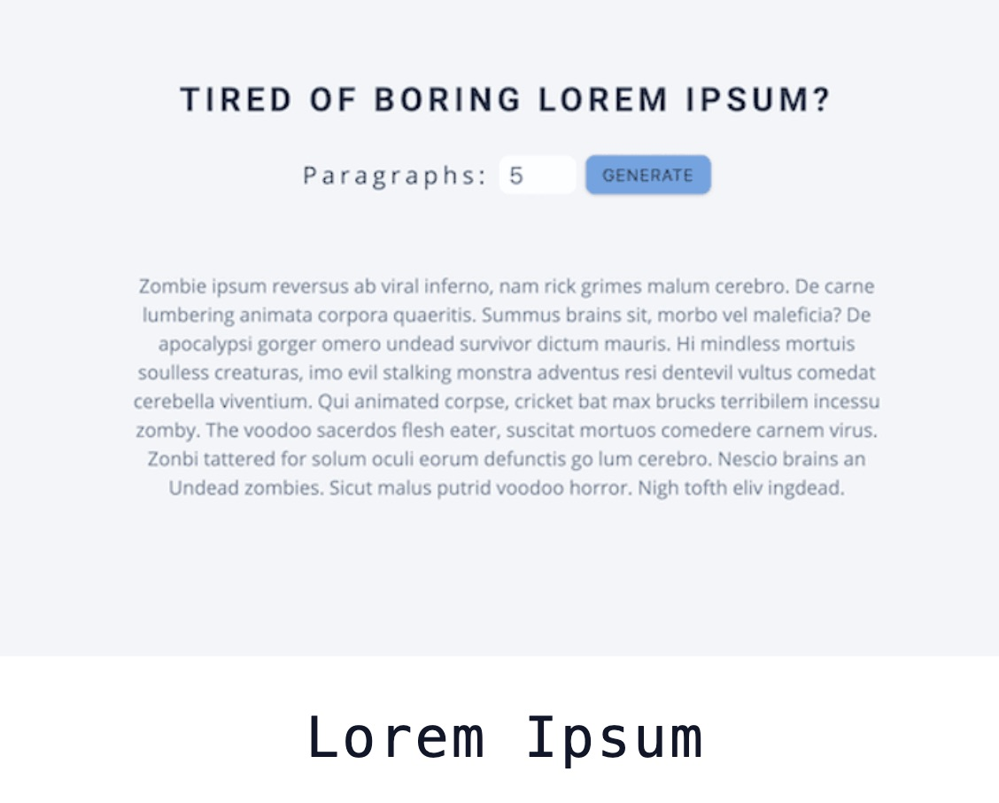 | 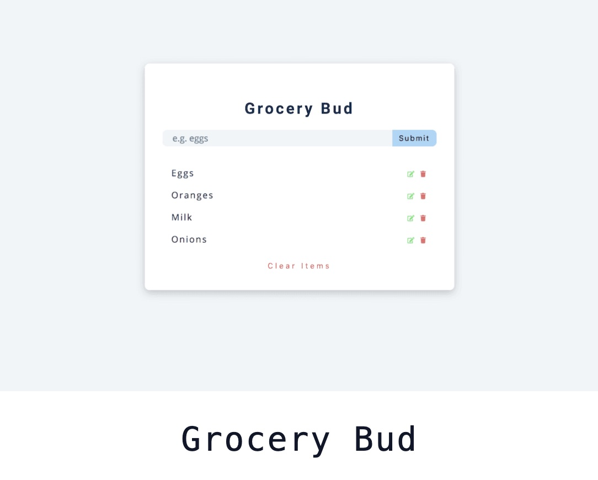 |  |

## Technologies Used

- HTML5
- CSS3
- Vanilla JavaScript

## Features

- Each project focuses on different aspects of JavaScript
- No external libraries or frameworks used
- Responsive design for various screen sizes

## How to Use

1. Clone this repository: [github.com/john-smilga/javascript-basic-projects](https://github.com/john-smilga/javascript-basic-projects)
2. Navigate to the project folder you're interested in
3. The **_final_** folder will be the completed project and the **_setup_** folder will be your copy to work on

## Credits

These projects were created as part of a tutorial on FreeCodeCamp's YouTube channel.

- Original Tutorial: [JavaScript Projects Tutorial](https://www.youtube.com/watch?v=3PHXvlpOkf4&t=24431s)

## License

This project is open source and available under the [MIT License](LICENSE).
